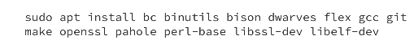
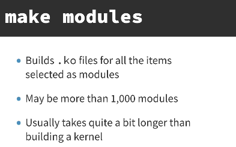
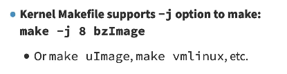
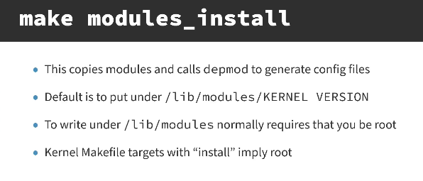

# Building and Installing the Kernel

### Concept
Building the kernel involves configuring the source code, compiling the main kernel image and all selected modules, and then installing them to the appropriate system directories.



### Key Points
- **Image Formats**:
    - **vmlinux**: The raw, uncompressed kernel binary.
    - **bzImage**: The standard compressed image for x86_64, supporting high memory loading.
    - **Image/zImage**: Common formats for ARM/ARM64 architectures.


- **Build Targets**:
    - **`make all`**: Builds everything selected in `.config`: the kernel image (`bzImage` on x86), all modules, and the device tree blobs (on ARM). Equivalent to running `make bzImage && make modules && make dtbs`.
    - **`make bzImage`**: Builds only the compressed kernel image. Does not compile any modules. Useful when iterating on core kernel changes without waiting for module compilation.
    - **`make modules`**: Builds only the loadable modules (`.ko` files) selected in `.config`. Requires a prior kernel build (it needs `vmlinux` for symbol resolution). Useful when only module source has changed.
- **Compilation Jobs**: The `-j` flag (e.g., `make -j$(nproc)`) allows for parallel compilation, significantly reducing build times.
- **Installation Steps**:
    - `make modules_install`: Copies `.ko` files to `/lib/modules/<version>/` and runs `depmod`.
    - `make install`: Copies the kernel image and System.map to `/boot` and updates the bootloader configuration.
- **System.map**:
    - A plain-text file generated alongside the kernel image that maps every kernel symbol name to its memory address.
    - Used by debugging tools (`klogd`, `gdb`, `crash`) to translate raw addresses in stack traces and oops messages back to function names.
    - Installed to `/boot/System.map-<version>` by `make install`.
    - Contains three symbol types: `T` (text/code), `D` (initialized data), `B` (uninitialized data/BSS).
    - Without it, kernel oops output contains only hex addresses, making debugging significantly harder.




### Example
**Full Build and Install Sequence:**
```bash
make menuconfig               # 1. Configure
make -j$(nproc)               # 2. Compile kernel and modules
sudo make modules_install     # 3. Install modules
sudo make install             # 4. Install kernel and update GRUB
```

**Building Only Modules After a Core Change:**
```bash
make bzImage -j$(nproc)       # Rebuild kernel image only
make modules -j$(nproc)       # Then rebuild modules separately
```

**Inspecting System.map:**
```bash
grep ' T do_sys_open' /boot/System.map-$(uname -r)
# Output: ffffffff812a3e10 T do_sys_open
# Shows the virtual address of the do_sys_open function in the running kernel.
```

### Notes / Observations
- **ARM Differences**: Unlike x86_64, ARM systems often lack a standardized BIOS/UEFI and rely on bootloaders like U-Boot to load uncompressed `Image` files directly into high memory.
- **vmlinux as a Byproduct**: The `vmlinux` file is always created first; `bzImage` is then generated by stripping and compressing `vmlinux`.
- **Permissions**: Installing modules and the kernel requires root privileges as it modifies system directories.



### Questions
- Why do modern ARM64 systems prefer uncompressed `Image` files over `zImage`?
- How does `depmod` generate the `modules.dep` file after installation?
