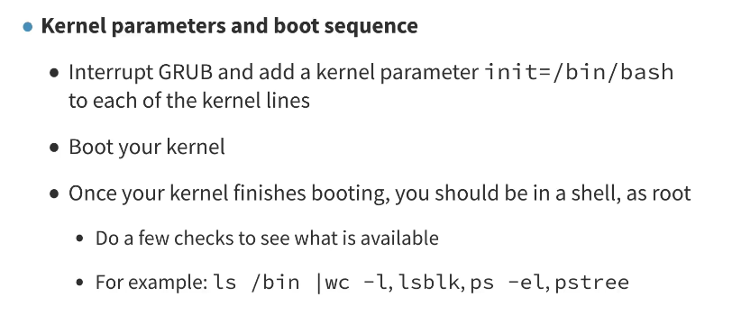
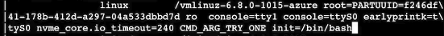
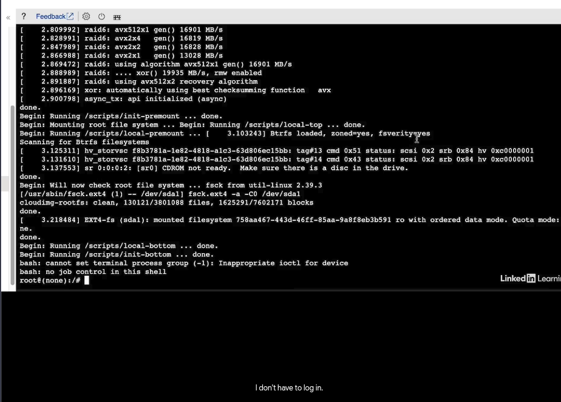
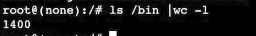
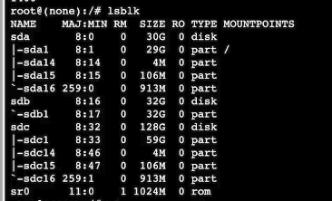
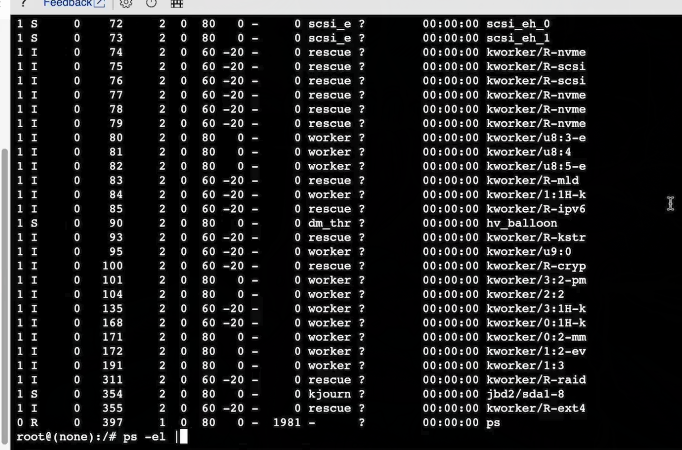
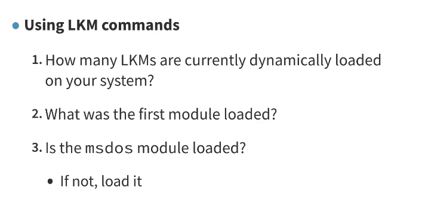
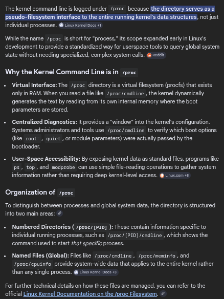

# Kernel and Module Challenges

### Concept
A collection of practical tasks designed to reinforce understanding of kernel threads, module management, and virtual filesystem interaction.




### Challenge: Investigating Kernel Threads (kworkers)
- **Task**: Identify what various `kworker` threads are doing.
- **Insight**: `kworker` threads are managed by kernel workqueues for asynchronous execution.
- **Method**: Use `ftrace` to trace workqueue events.
    ```bash
    echo workqueue:workqueue_queue_work > /sys/kernel/debug/tracing/set_event
    cat /sys/kernel/debug/tracing/trace_pipe | grep kworker
    ```
- **Security Note**: Grub interruption can be exploited to gain root access if the bootloader is not password-protected.






### Challenge: Kernel Module Inventory
- **Task**: Analyze the number and source of loaded modules.
- **Observations**:
    - `lsmod | wc -l`: Count currently loaded modules (subtract 1 for header).
    - Modules can be loaded from the `initramfs` during early boot.
- **Dependency Matching**: `modules.dep` should match the number of installed modules 1:1.



### Challenge: Sysfs Interaction
- **Task**: Locate hardware information via `sysfs`.
- **Findings**:
    - `/sys/class/dmi/id/vendor`: Used to find the motherboard/system vendor.
    - `/sys/block/*/slaves`: Shows relationship between block devices.


### Challenge: Automated Sysfs Vendor Extraction
- **Task**: Script the extraction of vendor and hardware identity information from `sysfs`.
- **Script**:
    ```bash
    #!/bin/bash
    echo "=== System Identity ==="
    echo "Vendor:       $(cat /sys/class/dmi/id/sys_vendor 2>/dev/null)"
    echo "Product:      $(cat /sys/class/dmi/id/product_name 2>/dev/null)"
    echo "Board:        $(cat /sys/class/dmi/id/board_vendor 2>/dev/null) $(cat /sys/class/dmi/id/board_name 2>/dev/null)"
    echo "BIOS:         $(cat /sys/class/dmi/id/bios_vendor 2>/dev/null) $(cat /sys/class/dmi/id/bios_version 2>/dev/null)"
    echo ""
    echo "=== PCI Devices ==="
    for dev in /sys/bus/pci/devices/*/; do
        vendor=$(cat "$dev/vendor" 2>/dev/null)
        device=$(cat "$dev/device" 2>/dev/null)
        class=$(cat "$dev/class" 2>/dev/null)
        driver=$(basename "$(readlink "$dev/driver" 2>/dev/null)" 2>/dev/null)
        printf "  %s  vendor=%s device=%s class=%s driver=%s\n" \
            "$(basename "$dev")" "$vendor" "$device" "$class" "${driver:-none}"
    done
    echo ""
    echo "=== Block Devices ==="
    for blk in /sys/block/*/; do
        name=$(basename "$blk")
        model=$(cat "$blk/device/model" 2>/dev/null | xargs)
        vendor=$(cat "$blk/device/vendor" 2>/dev/null | xargs)
        size_sectors=$(cat "$blk/size" 2>/dev/null)
        size_gb=$(( size_sectors * 512 / 1073741824 ))
        [ -n "$model" ] && printf "  %s: %s %s (%d GB)\n" "$name" "$vendor" "$model" "$size_gb"
    done
    ```
- **Key Paths**:
    - `/sys/class/dmi/id/`: DMI/SMBIOS system identity fields.
    - `/sys/bus/pci/devices/*/vendor`: PCI vendor ID (hex).
    - `/sys/block/*/device/model`: Storage device model string.

### Challenge: Dmesg and Command Line
- **Task**: Retrieve boot-time parameters.
- **Command**: `cat /proc/cmdline`.



### Questions
- Why do some `kworker` threads consume more CPU than others during high I/O wait?
- How does the kernel ensure that `sysfs` links remain consistent when hardware is hot-unplugged?
