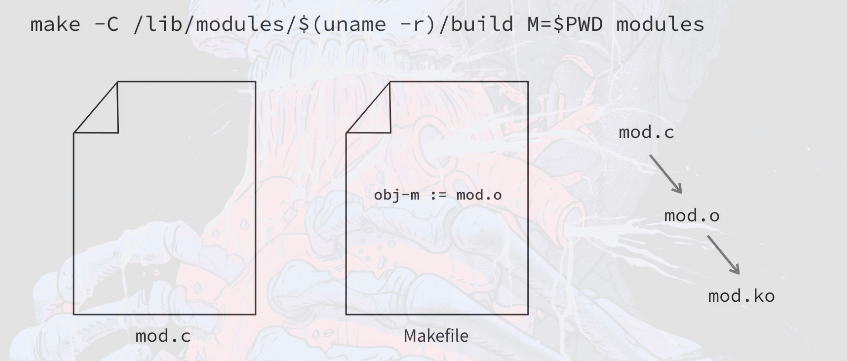
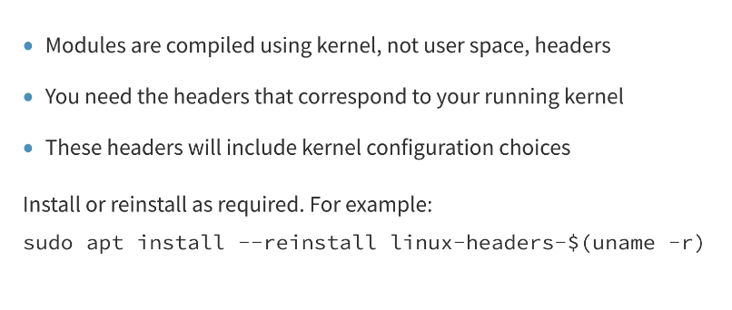

# Compiling Kernel Modules

### Concept
Compiling a Linux kernel module involves using the kernel's build system (kbuild) to create a `.ko` file. This process requires the module source code to be compiled against the headers and configuration of the target kernel.



### Key Points
- **Kernel Build System**: Modules must be compiled using the same compiler and configuration as the kernel they are intended for to ensure ABI compatibility.
- **Build Directory**: The standard path for kernel build files is `/lib/modules/$(uname -r)/build`, which is typically a symlink to the actual source or header directory.
- **Makefile Requirements**: A kernel module Makefile differs from a standard C Makefile; it must define `obj-m` to tell the kernel build system which objects to build as modules.
- **Symbol Check**: During compilation, the build system checks for symbol dependencies and generates a `.mod.c` file and other metadata.



### Example
**Minimal Makefile for a Kernel Module:**
```makefile
obj-m += mymodule.o

all:
	make -C /lib/modules/$(uname -r)/build M=$(PWD) modules

clean:
	make -C /lib/modules/$(uname -r)/build M=$(PWD) clean
```

**Simple Module Code (mymodule.c):**
```c
#include <linux/init.h>
#include <linux/module.h>

static int __init my_init(void) {
    printk(KERN_INFO "Module loaded\n");
    return 0;
}

static void __exit my_exit(void) {
    printk(KERN_INFO "Module unloaded\n");
}

module_init(my_init);
module_exit(my_exit);
MODULE_LICENSE("GPL");
```

### Notes / Observations
- **Compiler Consistency**: Using a different version of GCC than the one used for the kernel can lead to silent data structure misalignment and crashes.
- **M=$(PWD)**: This variable tells the kernel Makefile where your external module source is located.
- **obj-m vs obj-y**: `obj-m` builds a loadable module (`.ko`); `obj-y` builds the code statically into the kernel image (`vmlinuz`).

### Questions
- What are the implications of the `__init` and `__exit` macros on memory management?
- How does the kernel build system handle modules consisting of multiple source files?
