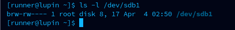

# Device Files and Nodes

### Concept
Device files (or device nodes) are special files located in the filesystem that allow user-space applications to communicate with kernel-space device drivers. They provide a standardized interface for I/O operations using standard file system calls.


### Key Points
- **Location**: Typically found in `/dev`.
- **Types**:
    - **Character Devices (c)**: Accessed as a stream of characters (e.g., keyboards, mice, serial ports).
    - **Block Devices (b)**: Accessed in fixed-size blocks, allowing for random access (e.g., hard drives, NVMe drives).
- **Identification**:
    - **Major Number**: Identifies the specific driver associated with the device. **Major 8** is reserved for SCSI disk devices (including SATA, USB storage, and virtual disks).
    - **Minor Number**: Identifies a specific instance or partition. For Major 8, each disk gets 16 minors (e.g., `/dev/sda` is 8:0, `/dev/sda1` is 8:1).
- **mknod Implementation**:
    - The `mknod` syscall (`sys_mknodat`) creates the inode for a device node.
    - It records the Major/Minor numbers in the filesystem metadata (`i_rdev`).
    - **Privilege**: Requires `CAP_MKNOD` capability.
- **Devtmpfs**: A virtual filesystem managed by the kernel that automatically creates and manages these nodes at boot.

### Example
**Inspecting Device Nodes:**
```bash
ls -l /dev/sda1
# Output: brw-rw---- 1 root disk 8, 1 ...
# 'b' indicates block device. '8' is major, '1' is minor.
```

**Creating a Device Node Manually:**
```bash
sudo mknod /tmp/my_disk b 8 1
# This node will act identically to /dev/sda1.
```

### Notes / Observations
- **Deferred Driver Attachment**: `mknod` only creates the entry in the filesystem; the driver itself is not "loaded" until a process actually `open()`s the node.
- **Major Number 8 Allocation**: Disk 1 (`sda`) uses minors 0-15; Disk 2 (`sdb`) uses 16-31, and so on up to 255.
- **Fundamental Nodes**: Crucial nodes like `/dev/null`, `/dev/zero`, and `/dev/console` are created by the kernel very early in the boot process via `devtmpfs`.
- **Loop Devices**: Virtual block devices that allow a file to be mounted as a filesystem (e.g., `/dev/loop0`).



### Questions
- How does the kernel manage Major number allocation to prevent conflicts between different vendors?
- What are the security implications of allowing device node creation on non-system partitions?
