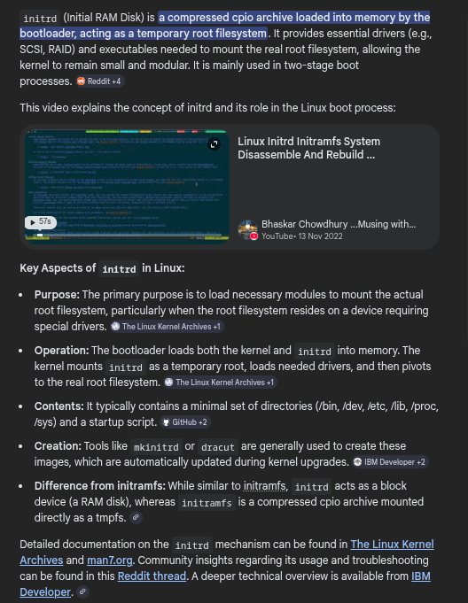
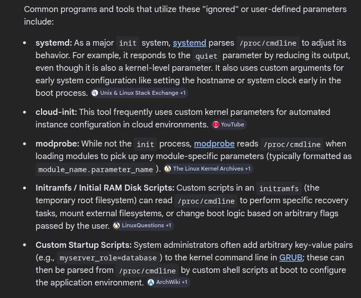
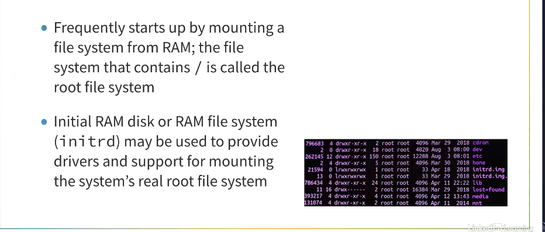

# GRUB and the Boot Process

### Concept
The bootloader (e.g., GRUB) is the first software that runs after the BIOS/UEFI. Its primary role is to load the kernel image and initial RAM disk into memory, set up boot parameters, and transfer execution control to the kernel. Modern kernels can also use `kexec` to bypass hardware initialization during reboots.



### Key Points
- **GRUB (Grand Unified Bootloader)**:
    - Supports multiple filesystems, allowing it to find kernels by name.
    - Provides a command-line interface for manual kernel selection and parameter adjustment.
- **Initramfs (Initial RAM Filesystem)**:
    - A compressed `cpio` archive unpacked into a `tmpfs` at boot.
    - **Purpose**: Provides the essential drivers (SATA, RAID, LVM, LUKS) and tools needed to find and mount the "real" root filesystem.
    - **Typical Structure**:
        - `/init`: The first script executed (PID 1).
        - `/bin` & `/sbin`: Essential utilities (often **BusyBox**).
        - `/lib/modules`: Specific `.ko` files required for storage access.
        - `/dev`, `/proc`, `/sys`: Mount points for virtual filesystems.
- **kexec Mechanism**:
    - A system call that allows booting into a new kernel directly from the running one.
    - **Benefit**: Bypasses BIOS/UEFI and bootloader hardware initialization, enabling fast reboots and kernel crash capturing (`kdump`).
- **Execution Flow**:
    - BIOS/UEFI -> GRUB -> Kernel (uncompressed) -> `start_kernel()` -> PID 1 (`init`).



### Example
**Modifying Boot Parameters in GRUB:**
Interrupting the boot process (usually with `Esc` or `Shift`) allows editing the `linux` line to add parameters like `init=/bin/bash` for emergency recovery.

**Using kexec for a Fast Reboot:**
```bash
# Load a new kernel and initramfs
kexec -l /boot/vmlinuz-new --initrd=/boot/initramfs-new --reuse-cmdline
# Execute the jump
kexec -e
```

### Notes / Observations
- **bzImage and Decompression**: The kernel often decompresses itself in place before starting the C-based initialization.
- **PID 0 (Idle Task)**: The kernel creates an "idle" thread (swapper) before spawning the first user-space process.
- **Crashkernel**: A reserved memory area for a secondary kernel that can capture memory state in the event of a system crash via `kexec`.



### Questions
- How does the kernel handle boot parameter registration via the `__setup()` macro?
- What is the specific protocol for the handover between UEFI and the Linux kernel EFI stub?
