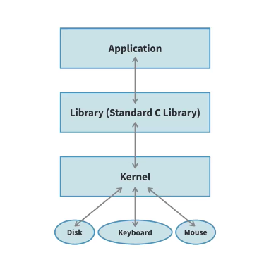
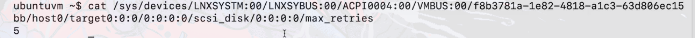

# Hardware Discovery and Control

### Concept
The Linux kernel is responsible for detecting hardware, loading appropriate drivers, and providing interfaces for both monitoring and control. Discovery occurs during boot and dynamically when devices are hot-plugged via the `uevent` mechanism. While most drivers run in kernel space, the `UIO` framework allows for specialized drivers in user space.



### Key Points
- **Discovery Tools**: `lshw`, `lspci`, `lsusb`, `lsblk`, `lscpu`.
- **Uevent Mechanism**:
    - The kernel broadcasts `uevents` (User Events) via **Netlink sockets** whenever a device is added, removed, or changed.
    - **udev**: A userspace daemon that listens for these events, applies rules (from `/etc/udev/rules.d/`), and manages device nodes in `/dev`.
- **Hardware Control**:
    - **Sysfs/Procfs**: Writing to specific virtual files.
    - **I/O Ports**: Direct hardware communication via `inb` and `outb`.
- **UIO (Userspace I/O)**:
    - A framework for writing device drivers in userspace.
    - **Mechanism**: A minimal kernel module handles interrupts and exposes device memory; the "real" driver logic runs as a Ring 3 process.
    - **Access**: The userspace process calls `mmap()` on `/dev/uioX` to map hardware registers directly.

### Example
**Monitoring Uevents:**
```bash
udevadm monitor               # View real-time uevents from the kernel
```

**Inspecting Disk Information:**
```bash
sudo hdparm -I /dev/sda       # View detailed hardware identity and capabilities
lsblk -t                      # View block devices with topology info
```

### Notes / Observations
- **User-space vs Kernel-space Drivers**: Most hardware is managed by kernel modules, but `UIO` is preferred for specialized hardware (like industrial I/O or FPGAs) where kernel-space complexity is unnecessary.
- **Safety of UIO**: If a UIO driver crashes, the kernel remains stable, as the driver logic is isolated in a standard process.
- **I/O vs Info**: `/dev` nodes are used for actual data transfer (I/O), while `/sys` entries are used to query or modify device metadata and state.



### Questions
- How does `udev` decide which driver to associate with a newly discovered VendorID/ProductID?
- What are the performance penalties for user-space drivers compared to kernel-level drivers?
