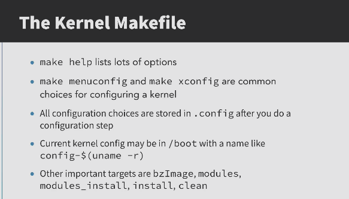
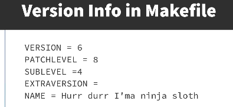
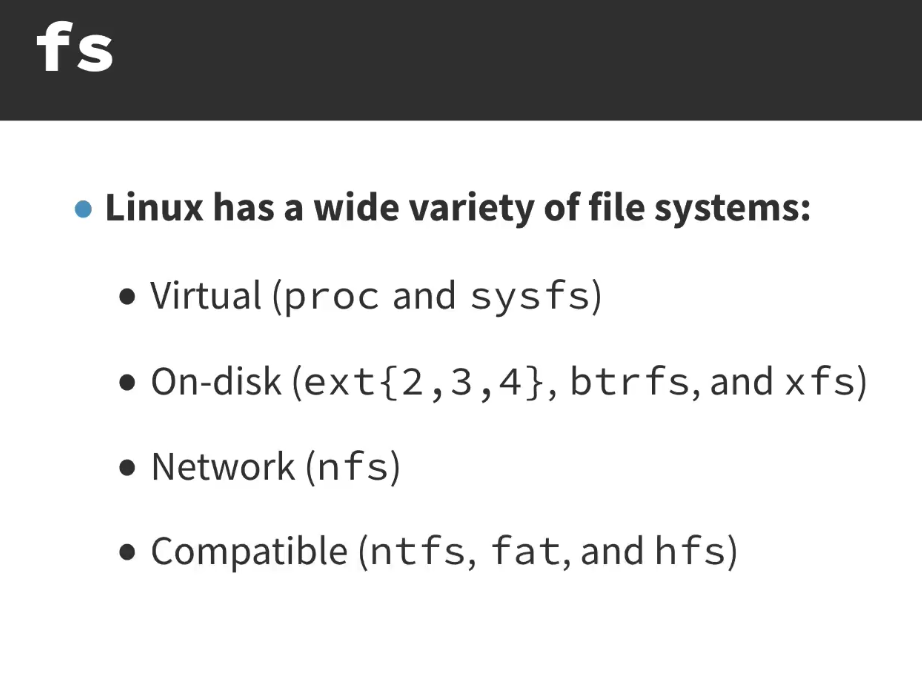
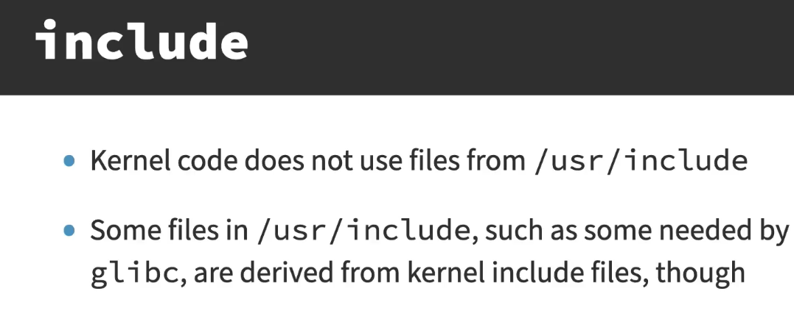
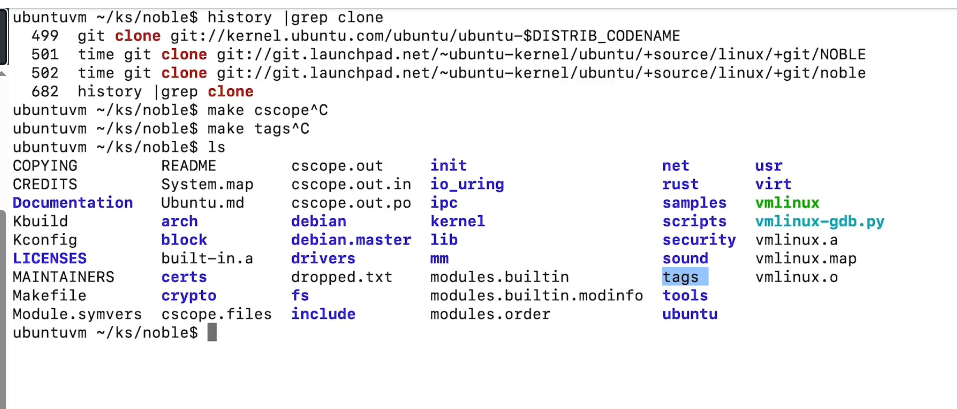

# Kernel Source Tree and Configuration

### Concept
The Linux kernel source tree is organized into a strict directory structure that separates architecture-specific code from generic subsystems. Configuration tools allow developers to customize the kernel by selecting which features and drivers to include.




### Key Points
- **Source Structure**:
    - `arch/`: Architecture-specific code (x86, arm, riscv).
    - `drivers/`: The largest directory; contains all hardware driver source.
    - `include/`: Kernel header files.
    - `kernel/`: Core subsystems like the scheduler and signal handling.
    - `mm/`: Memory management code.
    - `net/`: Networking protocols.




- **The `arch/x86` Directory**:
    - `boot/`: Bootloader handover code, real-mode setup, `bzImage` construction (compressed/vmlinux.bin).
    - `kernel/`: Core x86 kernel code: entry points (`entry_64.S`), syscall table, CPU setup, signal handling.
    - `mm/`: x86-specific memory management: page table handling, PAT (Page Attribute Table), `ioremap`.
    - `include/`: x86 headers split into `asm/` (kernel-internal) and `uapi/` (user-space visible).
    - `lib/`: Low-level utility functions: `memcpy`, `checksum`, `delay` calibration.
    - `platform/`: Platform-specific drivers (Intel MID, Mellanox, UV).
    - `crypto/`: Hardware-accelerated crypto (AES-NI, SHA).
    - `kvm/`: KVM hypervisor implementation for x86.
    - `events/`: Perf hardware event definitions for Intel/AMD CPUs.
    - `configs/`: Default config fragments (`x86_64_defconfig`, `i386_defconfig`).
    - `tools/`: x86-specific userspace tools for testing.
    - `Kconfig`: Top-level x86 configuration menu entries.
- **Configuration Tools**:
    - `make menuconfig`: Ncurses-based menu for configuration.
    - `make localmodconfig`: Strips the config to only include currently loaded modules.
    - `make defconfig`: Generates a default config for the current architecture.
    - `make oldconfig`: Updates an existing `.config` from a previous kernel version. It reads the old `.config`, applies it to the new kernel's Kconfig tree, and interactively prompts for any new options that did not exist in the old config. Existing options retain their previous values.
    - `make olddefconfig`: Same as `oldconfig` but silently accepts the default value for all new options instead of prompting. Preferred for automated builds.
- **The .config File**: The resulting file that tells the build system what to compile as built-in (`y`), as a module (`m`), or not at all (`n`).



### Example
**Locating a Driver in Source:**
A Realtek ethernet driver might be located at:
`/usr/src/linux/drivers/net/ethernet/realtek/r8169.c`

**Trimming a Configuration:**
```bash
make localmodconfig           # Uses lsmod to disable unused drivers
```

**Upgrading a Config to a New Kernel Version:**
```bash
cp /boot/config-5.15.0 /usr/src/linux-6.1/.config
cd /usr/src/linux-6.1
make oldconfig                # Prompts for each new option added since 5.15
make olddefconfig             # Or accept all defaults silently
```

### Notes / Observations
- **In-Tree vs Out-of-Tree**: Source for in-tree drivers is found directly in the `drivers/` directory.
- **Kconfig**: Files throughout the source tree that define the menu structure and dependencies for the configuration tools.
- **Distribution Configs**: Most users start by copying their current distribution's config from `/boot/config-$(uname -r)`.



### Questions
- What is the difference between `make oldconfig` and `make olddefconfig`?
- How does the `Kbuild` system handle conditional compilation based on `.config` values?
