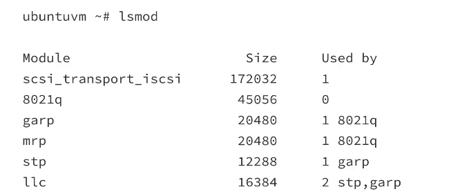
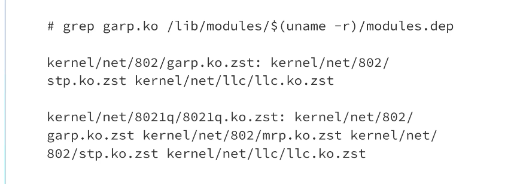

# Kernel Module Dependencies

### Concept
Kernel modules often rely on functions or symbols exported by other modules. The kernel build system and user-space tools must track these dependencies to ensure that modules are loaded in the correct order.



### Key Points
- **Symbol Exporting**: Modules use `EXPORT_SYMBOL()` or `EXPORT_SYMBOL_GPL()` to make their functions available to other modules.
- **modules.dep**: A text file generated by `depmod` that lists the full path to every module and its required dependencies.
- **Used By**: The `lsmod` output indicates which modules are currently using a specific module's exported symbols.
- **Loading Order**: If Module B depends on Module A, the kernel must load Module A before Module B can resolve its symbols and initialize.



### Example
**Inspecting Dependencies:**
```bash
modinfo garp
# Output will include a 'depends:' line listing required modules (e.g., 'stp')
```

**Generating Dependency Files:**
```bash
sudo depmod -a                # Updates modules.dep for all installed modules
```

### Notes / Observations
- **Initramfs Modules**: Modules required for booting are often bundled into the `initramfs`, which might include modules not present on the main root filesystem.
- **Implicit Dependencies**: Some modules might not have a hard code dependency but are used by user-space processes (e.g., SCSI generic devices).
- **Versioning**: Dependency resolution also checks the "vermagic" to ensure all modules in the chain are compatible.

### Questions
- How does the kernel handle "soft dependencies" (modules that should be loaded but aren't strictly required)?
- What happens if a module dependency is missing at runtime during a `modprobe`?
