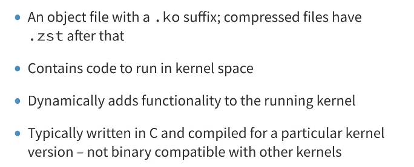
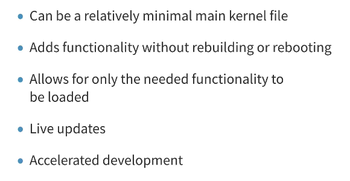
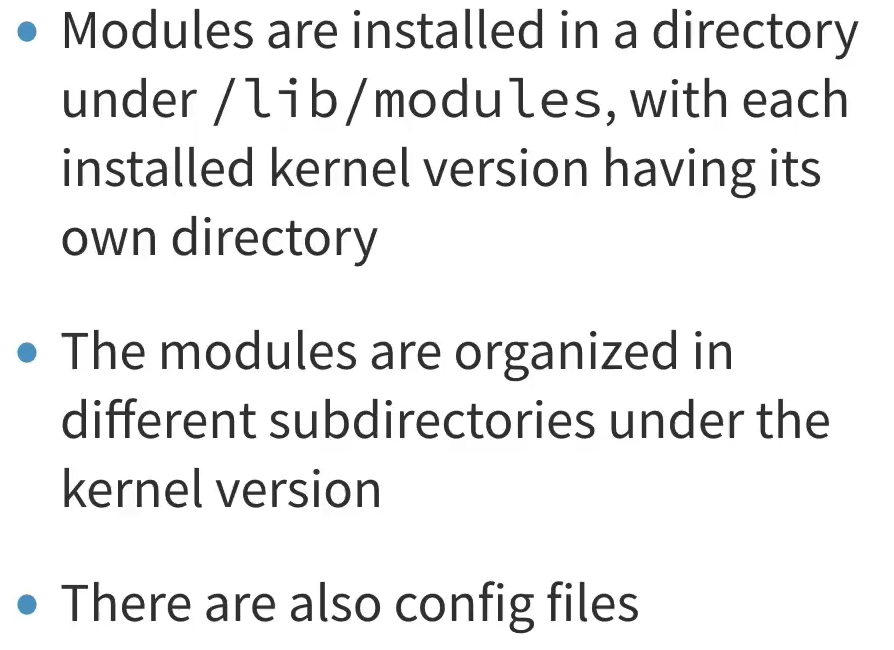
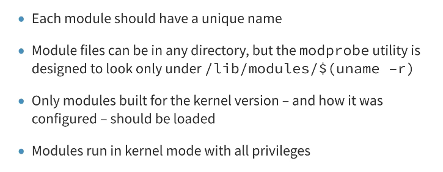
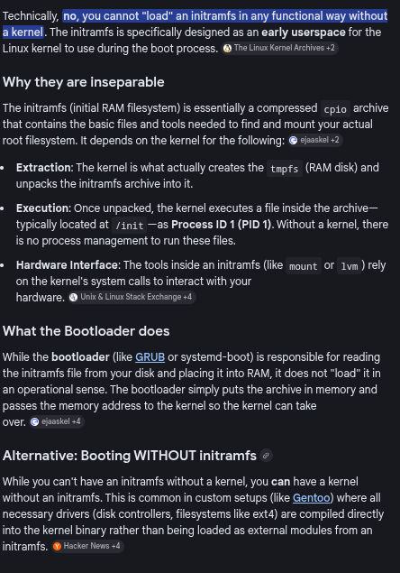

# Loadable Kernel Modules (LKM)

### Concept
Loadable Kernel Modules are object files containing code that can be dynamically loaded into or removed from the Linux kernel at runtime. This allows for a modular kernel that supports a wide range of hardware without requiring all drivers to be built into the core kernel binary.



### Key Points
- **File Format**: LKMs use the `.ko` (kernel object) extension.
- **Privilege**: Modules execute in Ring 0 (kernel space) with full system access.
- **Lifecycle**:
    - **Initialization**: Managed by the `module_init()` macro.
    - **Cleanup**: Managed by the `module_exit()` macro.
- **Binary Compatibility**: Modules are strictly tied to a specific kernel version. A module compiled for kernel 6.1.x will likely not load on 6.2.x due to ABI/API changes.
- **In-Tree vs Out-of-Tree**:
    - **In-Tree**: Included in the main Linux kernel source.
    - **Out-of-Tree**: Third-party modules (e.g., NVIDIA drivers) maintained separately.



### Example
**Listing Loaded Modules:**
```bash
lsmod                         # Lists name, size, and usage count
```

**Viewing Module Metadata:**
```bash
modinfo <module_name>         # Displays author, license, parameters, and dependencies
```



### Notes / Observations
- **No Standard C Library**: Modules cannot use `libc` (e.g., `printf`); they must use kernel equivalents like `printk`.
- **Memory Management**: Modules must carefully manage memory (e.g., `kmalloc`/`kfree`) as any leak or corruption can crash the entire system.
- **Binary Stability**: LKMs must be compiled against the specific kernel headers of the target system to ensure compatibility.



- **Symbol Resolution**: The kernel resolves symbols (functions/variables) when a module is loaded, similar to dynamic linking in user space.



### Questions
- What are the security risks of allowing unsigned kernel modules to be loaded?
- How does the kernel handle circular dependencies between multiple modules?
