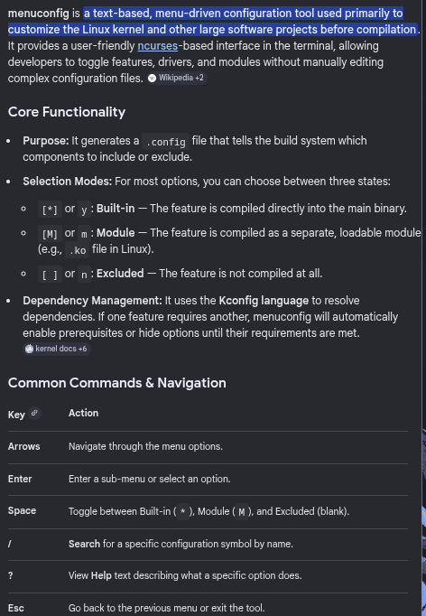
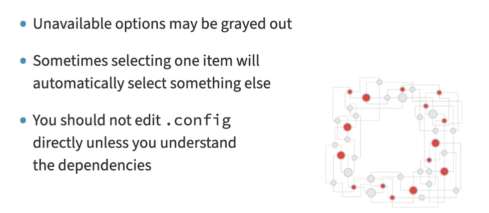
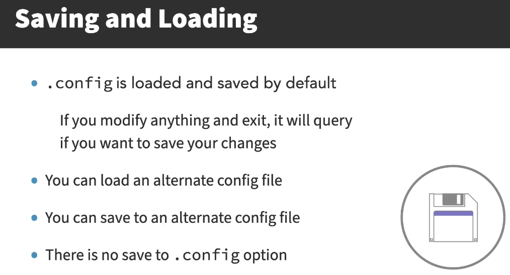

# Kernel Configuration with Menuconfig

### Concept
`make menuconfig` is an ncurses-based graphical interface used to configure the Linux kernel. It allows developers to browse a hierarchical menu of all available kernel options, drivers, and subsystems, and decide how they should be compiled.



### Key Points
- **Configuration Types**:
    - `[*]` (Built-in): Compiled directly into the kernel image (`y`).
    - `<M>` (Module): Compiled as a loadable kernel module (`m`).
    - `[ ]` (Excluded): Feature not included in the build (`n`).
- **Searching**: Use the `/` key to search for specific symbols or hardware strings (e.g., `INTEL_IOMMU`).
- **Dependencies**: Some options are only visible if their parent dependencies are met (e.g., USB drivers require the USB support subsystem to be enabled).
- **Persistence**: Configuration is saved to the `.config` file in the root of the kernel source tree.
- **`scripts/config` Utility**: A command-line tool for editing `.config` without an interactive UI. Useful for scripted or automated kernel builds.
    - `--enable CONFIG_OPTION`: Sets an option to `y`.
    - `--disable CONFIG_OPTION`: Sets an option to `n`.
    - `--module CONFIG_OPTION`: Sets an option to `m`.
    - `--set-val CONFIG_OPTION value`: Sets an option to a specific integer or hex value.
    - `--state CONFIG_OPTION`: Queries the current state of an option.
- **Testing Configurations**:
    - `make allyesconfig`: Sets every option to `y` (built-in). Produces a massive monolithic kernel. Used for compile-testing to ensure every feature builds without errors. Results in very long build times and a huge kernel image.
    - `make allmodconfig`: Sets every tristate option to `m` (module). Produces a minimal base kernel with everything else as modules. Also used for compile-testing but results in a smaller core image with thousands of `.ko` files. Preferred over `allyesconfig` for CI builds because module compilation can be parallelized more efficiently.



### Example
**Launching Menuconfig:**
```bash
make menuconfig
```
**Searching for a symbol:**
Press `/`, type `NET_SCHED`, and press `Enter`. The output will show the location of the option in the menu hierarchy and any required dependencies.

**Using `scripts/config` for Automated Builds:**
```bash
scripts/config --enable CONFIG_BPF_SYSCALL
scripts/config --module CONFIG_VFAT_FS
scripts/config --disable CONFIG_DEBUG_INFO
scripts/config --state CONFIG_SMP
# Output: y
```

**Generating Test Configurations:**
```bash
make allyesconfig             # Everything built-in; tests maximum code paths
make allmodconfig             # Everything as modules; faster base build
```

### Notes / Observations
- **Required Libraries**: On Debian/Ubuntu, `libncurses5-dev` or `libncurses-dev` must be installed to run menuconfig.
- **Help Text**: Selecting an option and pressing `?` or `h` provides detailed documentation on what that specific feature does.
- **Load/Save**: You can load an existing `.config` file or save a custom configuration to a specific filename within the interface.



### Questions
- How does the `Kconfig` language define the relationship between mutually exclusive options?
- What are the advantages of `make nconfig` or `make xconfig` over `menuconfig`?
