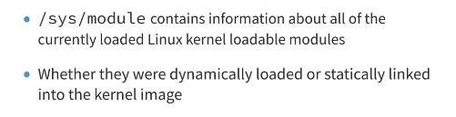
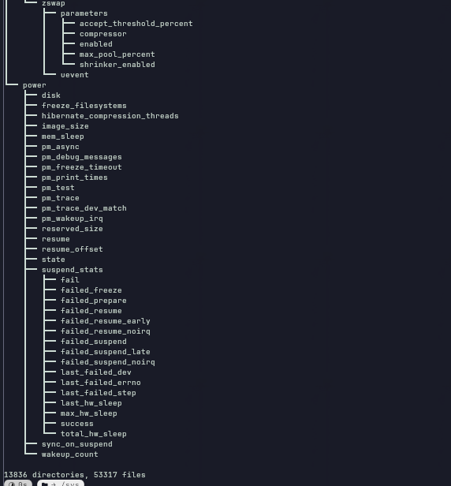
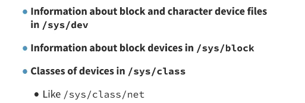

# Kernel Messaging and Logging

### Concept
The kernel provides mechanisms for code to output informational and debugging messages. These messages are stored in a ring buffer in RAM and can be viewed or logged by user-space daemons. Specialized filesystems and modules extend these capabilities for debugging and remote logging.



### Key Points
- **printk()**: The primary internal kernel function for generating messages.
- **Kernel Ring Buffer**: A fixed-size RAM buffer that stores `printk` output.
- **Loglevels (`/proc/sys/kernel/printk`)**: Controls which messages are sent to the console.
    - **8 Standard Levels**: Range from `0` (KERN_EMERG, highest) to `7` (KERN_DEBUG, lowest).
    - **Configuration**: Reading the file returns four values: Console Loglevel, Default Message Loglevel, Minimum Console Loglevel, and Default Console Loglevel.
- **Debug and Tracing Filesystems**:
    - **DebugFS (`/sys/kernel/debug`)**: A "no-rules" interface for kernel developers to export internal variables and statistics.
    - **TraceFS (`/sys/kernel/tracing`)**: A structured interface for the kernel's tracing infrastructure (ftrace, tracepoints).
- **Netconsole**: A kernel module that broadcasts kernel logs over the network via UDP. Useful for debugging headless systems or capturing logs during a crash.



### Example
**Viewing and Configuring Loglevels:**
```bash
cat /proc/sys/kernel/printk      # View current loglevels
echo "7 4 1 7" > /proc/sys/kernel/printk  # Enable all debug messages on console
```

**Using Netconsole:**
```bash
# Load netconsole to send logs to a remote receiver
modprobe netconsole netconsole=@/eth0,@192.168.1.100/
# Listen on remote receiver
nc -u -l -p 6666
```

### Notes / Observations
- **TraceFS vs DebugFS**: While tracing originally lived in debugfs (`/sys/kernel/debug/tracing`), it has been moved to its own `tracefs` for better security and structure on production systems.
- **dmesg -w**: Follows the ring buffer in real-time.
- **Buffer Overwrites**: Because it is a ring buffer, older messages are overwritten when the buffer fills.
- **Early Boot**: Kernel messages are critical for debugging boot failures before the root filesystem is mounted.
- **DebugFS Mount Process**: If `/sys/kernel/debug` appears empty, debugfs is not mounted. Troubleshooting steps:
    1. **Check if the kernel supports debugfs**: `grep DEBUG_FS /boot/config-$(uname -r)` should show `CONFIG_DEBUG_FS=y`.
    2. **Mount manually**: `sudo mount -t debugfs debugfs /sys/kernel/debug`.
    3. **Verify**: `ls /sys/kernel/debug/` should now show entries like `tracing/`, `usb/`, `block/`, etc.
    4. **Persist across reboots**: Add `debugfs /sys/kernel/debug debugfs defaults 0 0` to `/etc/fstab`.
    5. **Systemd systems**: Most distributions auto-mount debugfs via `systemd`'s `sys-kernel-debug.mount` unit. Check with `systemctl status sys-kernel-debug.mount`.
    6. **Security**: DebugFS exposes kernel internals. On production systems, it may be intentionally disabled or mounted with restricted permissions (`mode=0700`). The kernel parameter `debugfs=off` disables it entirely.



### Questions
- How can the size of the kernel ring buffer be adjusted via boot parameters?
- What is the impact of high-frequency `printk` calls on system performance?
