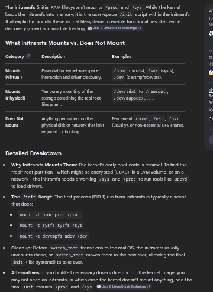

# System Calls (Syscalls)
# System Calls (Syscalls)

### Concept
System calls are the standardized interface through which user-space programs request services from the Linux kernel. They transition the CPU from restricted user mode to privileged kernel mode to perform tasks like file operations, process creation, and network communication.



### Key Points
- **Standard Interface**: Approximately 550 system calls exist in the modern Linux kernel.
- **UAPI (User API)**: Headers like `include/uapi/asm-generic/unistd.h` define syscall numbers. Architecture-independent mappings (e.g., `read` mapped to 63) aim for cross-architecture consistency.
- **vDSO (virtual Dynamic Shared Object)**: A small shared library mapped into every process by the kernel to accelerate frequent syscalls.
    - **High-Frequency Calls**: Calls like `gettimeofday` and `time` are executed entirely in user space by reading a kernel-provided "vvar" page.
    - **Performance**: Eliminates the overhead of a context switch (Ring 3 to Ring 0).
- **Architecture-Specific Registers**:
    | Feature | x86-64 | ARM64 | RISC-V |
    | :--- | :--- | :--- | :--- |
    | **Syscall No.** | `rax` | `x8` | `a7` |
    | **Arguments** | `rdi`, `rsi`, `rdx`, `r10`, `r8`, `r9` | `x0` - `x5` | `a0` - `a5` |
    | **Return Value** | `rax` | `x0` | `a0` |
    | **Trap Inst.** | `syscall` | `svc #0` | `ecall` |
- **Invocation**:
    - Performed via the architecture-specific trap instruction.
    - Parameters are passed via registers for maximum efficiency.
- **Libc Wrapper**: The C standard library (glibc) provides high-level functions (e.g., `printf()`) that translate to one or more raw syscalls (e.g., `write`).
- **Return Values**: Success returns a result (often 0 or a count); negative return values indicate errors, which `libc` maps to the global `errno` variable.

### Example
**Syscall Execution (sys_write) via Registers (x86-64):**
| Register | Purpose | Value |
| --- | --- | --- |
| `rax` | Syscall Number | 1 (`sys_write`) |
| `rdi` | File Descriptor | 1 (`stdout`) |
| `rsi` | Buffer Address | Pointer to "Hello" |
| `rdx` | Length | 5 |

**Tracing Syscalls:**
```bash
strace -c date    # Summary of syscalls used by 'date'
strace -p <pid>   # Trace a running process
```

### Notes / Observations
- **Architecture Differences**: Syscall numbers vary by architecture. For example, `read` is syscall 0 on x86-64 but 63 in the generic `asm-generic` mapping.
- **Errno**: If a syscall fails, the kernel returns a negative error code (e.g., `-EACCES`). `libc` sets `errno` to the positive equivalent (`13`) and returns `-1` to the caller.
- **vDSO Mapping**: You can see the vDSO mapping in any process by checking `/proc/<pid>/maps`. It appears as `[vdso]`.
- **Tracing Built-ins**: `strace` cannot trace shell built-ins like `cd` directly; you must trace the shell itself (`strace bash -c 'cd /tmp'`).

### Questions
- How does the kernel validate the safety of pointers passed as syscall arguments to prevent kernel memory corruption?
- What is the overhead difference between the `syscall` instruction and older methods like `int 0x80`?

