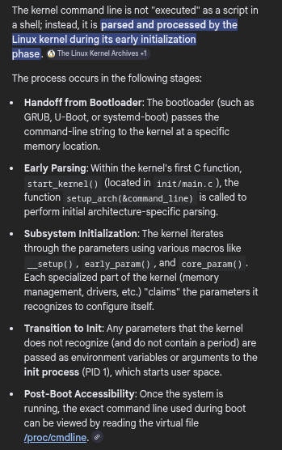
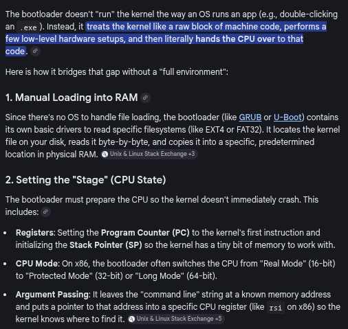
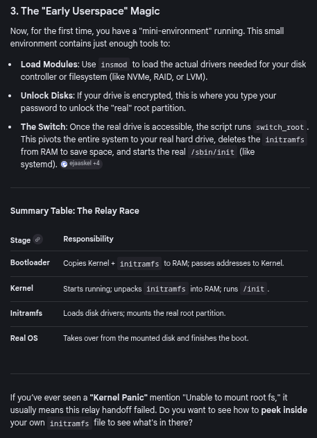
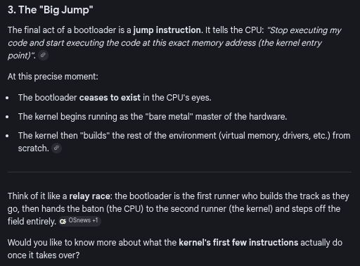

# The Linux Kernel: Definition and Core Functions

### Concept
The Linux kernel is a compiled binary that manages hardware resources and provides a execution environment for user-space applications. It operates in a privileged CPU mode (Ring 0), acting as the primary intermediary between hardware and software.



### Key Points
- **Binary Image**: Typically stored as `/boot/vmlinuz-<version>`. The `vmlinuz` name stands for "Virtual Memory Linux," with the `z` suffix indicating compression (e.g., gzip, lz4, zstd).
- **Initramfs / Initrd**: A temporary root filesystem loaded into RAM by the bootloader. It contains the essential drivers and tools required to mount the actual root filesystem.
- **Bootloader Handover**: The bootloader (GRUB, systemd-boot) loads the kernel and passes a **boot parameters** data structure (`arch/x86/include/uapi/asm/bootparam.h`) containing hardware info and command-line arguments.
- **Privilege Rings**: Linux utilizes a two-level privilege model:
    - **Ring 0 (Kernel Space)**: Full hardware access and unrestricted memory access.
    - **Ring 3 (User Space)**: Restricted access; must use system calls to interact with hardware or other processes.
- **The Kernel is Not a Process**: It is a standalone entity that manages the execution and scheduling of all processes.



### Example
**Checking Kernel Binary Type:**
```bash
file /boot/vmlinuz-$(uname -r)
# Output: Linux kernel x86 boot executable bzImage
```

**Viewing Kernel Command Line:**
```bash
cat /proc/cmdline
```

### Notes / Observations
- **bzImage**: The "Big ZImage" format includes a decompressor stub at the beginning that handles self-decompression into RAM during boot.
- **Ring Transitions**: A user-space process attempting direct hardware access triggers a CPU fault, which the kernel intercepts (often resulting in a `SIGSEGV`).
- **PID 1**: After initialization, the kernel launches the first user-space process, typically `systemd`.




### Questions
- How does the kernel transition from the architecture-specific assembly entry point to the generic C `start_kernel()` function?
- What are the implications of the "lazy allocation" strategy for real-time systems?
