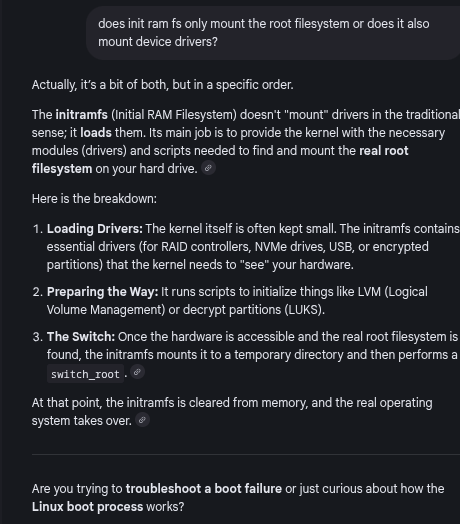

# Usage of Strace

### Concept
`strace` is a diagnostic, debugging, and instructional user-space utility for Linux. It is used to monitor and record the system calls made by a process and the signals it receives.



### Key Points
- **System Call Interception**: `strace` intercepts syscalls before they enter the kernel, allowing you to see arguments and return values.
- **Filtering**: You can filter for specific syscalls (e.g., `-e open,read`) to reduce output noise.
- **Output Redirection**: Syscall logs are sent to `stderr` by default; use `-o` to save to a file.
- **Process Attachment**: You can trace an already running process by specifying its PID with `-p`.
- **Tracing Child Processes (`-f`)**:
    - The `-f` flag tells `strace` to follow child processes created by `fork`, `vfork`, or `clone`.
    - Without `-f`, only the parent process is traced. Child processes spawned by `fork()` execute untraced and their syscalls are invisible.
    - Each line of output is prefixed with the PID of the process that made the call, making it possible to distinguish parent from child activity.
    - Combined with `-o`, writes all process traces to a single file with interleaved PID-prefixed lines.
- **ltrace (Library Call Tracer)**:
    - A separate tool that traces calls to shared library functions (e.g., `malloc`, `strlen`, `fopen`) rather than system calls.
    - Uses the same `ptrace` mechanism as `strace` but intercepts at the PLT (Procedure Linkage Table) level.
    - **Filtering**: `-e malloc+free` traces only specific library calls.
    - **Comparison**: `strace` shows kernel-level activity (`open`, `read`, `mmap`); `ltrace` shows user-space library activity (`fopen`, `fread`, `printf`). Use both together to get a complete picture of program behavior.
    - **Limitation**: Does not work with statically linked binaries (no PLT to intercept).

### Example
**Summarizing Syscall Activity:**
```bash
strace -c date
# Shows a table of syscalls, counts, and time spent.
```

**Tracing File Redirection:**
To see which process opens `/dev/null` during `date > /dev/null`:
```bash
strace -f -o trace.out bash -c 'date > /dev/null'
grep "/dev/null" trace.out
# Reveals that the shell (bash) performs the open() call before executing 'date'.
```

**Tracing Child Processes with `-f`:**
```bash
strace -f -e trace=write bash -c 'echo parent; bash -c "echo child"'
# Output shows write() calls from both bash processes, each prefixed with its PID:
# 1234 write(1, "parent\n", 7)  = 7
# 1235 write(1, "child\n", 6)   = 6
```

**Tracing Library Calls with `ltrace`:**
```bash
ltrace ls /tmp
# Output shows library calls like:
# opendir("/tmp")                = 0x55a3c2a0
# readdir(0x55a3c2a0)            = { "file1.txt" }
# strlen("file1.txt")            = 9
```

**Combining strace and ltrace:**
```bash
strace -e open ls /tmp 2>&1 | head    # Kernel-level file opens
ltrace -e fopen ls /tmp 2>&1 | head   # Library-level file opens
```

### Notes / Observations
- **Performance Impact**: `strace` significantly slows down the traced process because it triggers a context switch for every syscall.
- **Tracing Built-ins**: Since `cd` is a shell built-in, you must trace the shell itself: `strace bash -c 'cd /tmp'`.
- **Interpreting Return Values**: `strace` decodes return values into human-readable strings.

### Questions
- How does the `ptrace` system call enable `strace` to intercept execution?
- What are the security implications of using `strace` on a setuid binary?
