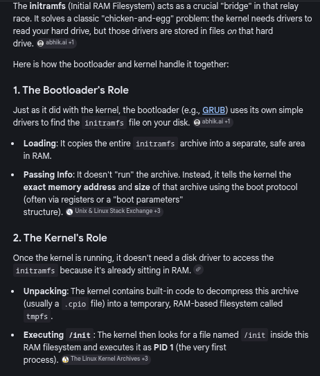

# Virtual File System (VFS) and Kernel Interfaces

### Concept
The Virtual File System (VFS) is a kernel abstraction layer that allows user space to interact with various data sources (physical disks, network protocols, or kernel state) using standard file I/O system calls. Virtual filesystems like `/proc` and `/sys` generate their content dynamically in RAM when accessed.



### Key Points
- **Core VFS Structures**:
    - **Inode (Index Node)**: Represents the **metadata** of a unique file (size, permissions, timestamps, block pointers). It exists as long as there is at least one link to it. Filenames are *not* stored here.
    - **Dentry (Directory Entry)**: Represents a **path component** and maps a filename to an inode. Dentries are in-memory objects used to speed up path resolution via the **dentry cache (dcache)**.
- **/proc (procfs)**:
    - Focuses on process and kernel state information.
    - Each process has a directory at `/proc/<pid>/` containing memory maps, file descriptors, and status.
- **/sys (sysfs)**:
    - Provides a structured view of the kernel's device model (buses, devices, drivers).
    - Key paths: `/sys/class/` (device types), `/sys/bus/` (PCI/USB/etc), `/sys/devices/` (physical hierarchy).
- **/dev (devtmpfs)**:
    - Contains device nodes representing hardware (e.g., `/dev/sda`) or virtual devices (`/dev/null`).
- **Dynamic Content**: Files are synthesized on the fly by kernel functions, ensuring data is always current.

### Example
**Interacting with VFS:**
```bash
cat /proc/meminfo             # View system memory usage
cat /sys/block/sda/size       # Check disk size in sectors
ls /proc/self/fd              # List open file descriptors of the current shell
echo 1 > /sys/class/backlight/intel_backlight/brightness  # Adjust hardware state
```

### Notes / Observations
- **Inode Persistence**: Inodes have a disk-resident counterpart in physical filesystems, but in VFS, they are temporary objects that represent the current state of a file.
- **Hard Links**: A single inode can be pointed to by multiple dentries (hard links). Deleting a file removes a dentry; the inode is only freed when the link count reaches zero.
- **/proc/sys**: A specific subtree for tuning kernel parameters (sysctl) at runtime.
- **Device Nodes**: Major numbers identify the driver; Minor numbers identify the specific instance or partition.
- **VFS Abstraction**: The kernel translates generic calls (`read()`) into filesystem-specific or driver-specific operations.


### Questions
- What are the technical differences between `ramfs`, `tmpfs`, and the mechanisms used by `procfs`?
- How does `udev` manage the dynamic creation of entries in `/dev` upon hardware discovery?
